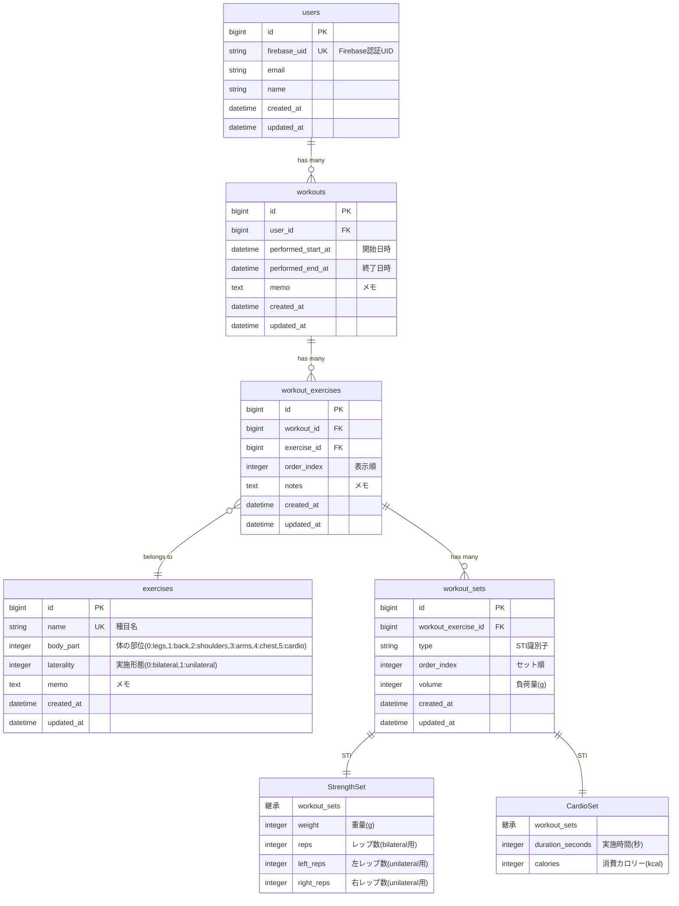

# データベース設計

## ER 図

## テーブル定義詳細

### users（ユーザー）

| カラム名     | 型           | NULL | デフォルト        | 説明              |
| ------------ | ------------ | ---- | ----------------- | ----------------- |
| id           | bigint       | NO   | AUTO_INCREMENT    | 主キー            |
| firebase_uid | varchar(128) | NO   | -                 | Firebase 認証 UID |
| email        | varchar(255) | NO   | -                 | メールアドレス    |
| name         | varchar(255) | YES  | NULL              | 表示名            |
| created_at   | datetime     | NO   | CURRENT_TIMESTAMP | 作成日時          |
| updated_at   | datetime     | NO   | CURRENT_TIMESTAMP | 更新日時          |

### exercises（種目マスタ）

| カラム名       | 型           | NULL | デフォルト        | 説明                          |
| -------------- | ------------ | ---- | ----------------- | ----------------------------- |
| id             | bigint       | NO   | AUTO_INCREMENT    | 主キー                        |
| name           | varchar(255) | NO   | -                 | 種目名                        |
| body_part      | integer      | NO   | -                 | 体の部位（enum: 0-5）       |
| laterality     | integer      | YES  | NULL              | 実施形態（enum: 0-1）         |
| memo           | text         | YES  | NULL              | メモ                          |
| created_at     | datetime     | NO   | CURRENT_TIMESTAMP | 作成日時                      |
| updated_at     | datetime     | NO   | CURRENT_TIMESTAMP | 更新日時                      |

#### body_part の値

| 値 | 名称      | 説明         |
|----|---------|-------------|
| 0  | legs    | 脚部         |
| 1  | back    | 背中         |
| 2  | shoulders| 肩          |
| 3  | arms    | 腕部         |
| 4  | chest   | 胸部         |
| 5  | cardio  | 有酸素運動   |

#### laterality の値

| 値 | 名称       | 説明           |
|----|-----------|---------------|
| 0  | bilateral | 両側同時実施   |
| 1  | unilateral| 片側ずつ実施   |

※ 有酸素運動（body_partがcardio）の場合は NULL

### workouts（ワークアウト）

| カラム名           | 型       | NULL | デフォルト        | 説明             |
| ------------------ | -------- | ---- | ----------------- | ---------------- |
| id                 | bigint   | NO   | AUTO_INCREMENT    | 主キー           |
| user_id            | bigint   | NO   | -                 | ユーザー ID      |
| performed_start_at | datetime | NO   | -                 | 開始日時         |
| performed_end_at   | datetime | YES  | NULL              | 終了日時         |
| memo               | text     | YES  | NULL              | メモ             |
| created_at         | datetime | NO   | CURRENT_TIMESTAMP | 作成日時         |
| updated_at         | datetime | NO   | CURRENT_TIMESTAMP | 更新日時         |

### workout_exercises（ワークアウト内の種目）

| カラム名     | 型       | NULL | デフォルト        | 説明                       |
| ------------ | -------- | ---- | ----------------- | -------------------------- |
| id           | bigint   | NO   | AUTO_INCREMENT    | 主キー                     |
| workout_id   | bigint   | NO   | -                 | ワークアウト ID            |
| exercise_id  | bigint   | NO   | -                 | 種目 ID                    |
| order_index  | integer  | NO   | -                 | 表示順                     |
| notes        | text     | YES  | NULL              | メモ                       |
| created_at   | datetime | NO   | CURRENT_TIMESTAMP | 作成日時                   |
| updated_at   | datetime | NO   | CURRENT_TIMESTAMP | 更新日時                   |

### workout_sets（セット）

| カラム名            | 型           | NULL | デフォルト        | 説明                              |
| ------------------- | ------------ | ---- | ----------------- | --------------------------------- |
| id                  | bigint       | NO   | AUTO_INCREMENT    | 主キー                            |
| workout_exercise_id | bigint       | NO   | -                 | WorkoutExercise ID                |
| type                | varchar(255) | NO   | -                 | STI 識別子(StrengthSet/CardioSet) |
| weight              | integer      | YES  | NULL              | 重量(グラム) ※StrengthSet 用      |
| reps                | integer      | YES  | NULL              | レップ数 ※StrengthSet 用          |
| left_reps           | integer      | YES  | NULL              | 左レップ数 ※StrengthSet 用        |
| right_reps          | integer      | YES  | NULL              | 右レップ数 ※StrengthSet 用        |
| duration_seconds    | integer      | YES  | NULL              | 実施時間(秒) ※CardioSet 用        |
| calories            | integer      | YES  | NULL              | 消費カロリー(kcal) ※CardioSet 用  |
| order_index         | integer      | NO   | -                 | セット順                          |
| volume              | integer      | NO   | 0                 | 負荷量(グラム)                    |
| created_at          | datetime     | NO   | CURRENT_TIMESTAMP | 作成日時                          |
| updated_at          | datetime     | NO   | CURRENT_TIMESTAMP | 更新日時                          |

## インデックス設計

### users

- `index_users_on_firebase_uid` (firebase_uid) UNIQUE
- `index_users_on_email` (email) UNIQUE

### exercises

- `index_exercises_on_name` (name) UNIQUE
- `index_exercises_on_body_part` (body_part)

### workouts

- `index_workouts_on_user_id` (user_id)
- `index_workouts_on_user_id_and_performed_start_at` (user_id, performed_start_at)

### workout_exercises

- `index_workout_exercises_on_workout_id` (workout_id)
- `index_workout_exercises_on_exercise_id` (exercise_id)
- `index_workout_exercises_on_workout_id_and_exercise_id` (workout_id, exercise_id) UNIQUE
- `index_workout_exercises_on_workout_id_and_order_index` (workout_id, order_index) UNIQUE

### workout_sets

- `index_workout_sets_on_workout_exercise_id` (workout_exercise_id)
- `index_workout_sets_on_type` (type)
- `index_workout_sets_on_volume` (volume)
- `index_workout_sets_on_workout_exercise_id_and_order_index` (workout_exercise_id, order_index) UNIQUE

## 外部キー制約

- workouts.user_id → users.id (CASCADE DELETE)
- workout_exercises.workout_id → workouts.id (CASCADE DELETE)
- workout_exercises.exercise_id → exercises.id (RESTRICT)
- workout_sets.workout_exercise_id → workout_exercises.id (CASCADE DELETE)

## データ型の選択理由

### integer 型の使用

- **重量**: グラム単位で保存することで小数点計算を回避
- **カロリー**: kcal 単位で整数として保存
- **時間**: 秒単位で保存

### datetime 型

- すべての日時は UTC で保存
- ActiveRecord が自動的にタイムゾーン変換を処理

### STI（単一テーブル継承）

- workout_sets テーブルで type カラムを使用
- StrengthSet と CardioSet で異なる振る舞いを実装

#### Setモデルの詳細な振る舞い

1. **typeの決定**
   - `workout_exercise.exercise.body_part` が `cardio` 以外の場合 → `StrengthSet`
   - `workout_exercise.exercise.body_part` が `cardio` の場合 → `CardioSet`

2. **StrengthSetのフィールド使用パターン**
   - `exercise.laterality` が `bilateral`（両側同時実施）の場合：
     - 使用フィールド: `weight`, `reps`
     - `left_reps`, `right_reps` は使用しない
   - `exercise.laterality` が `unilateral`（片側ずつ実施）の場合：
     - 使用フィールド: `weight`, `left_reps`, `right_reps`
     - `reps` は使用しない

3. **CardioSetのフィールド使用パターン**
   - 使用フィールド: `duration_seconds`, `calories`
   - `weight`, `reps`, `left_reps`, `right_reps` は使用しない

## パフォーマンス考慮事項

### 事前計算フィールド

- workout_sets.volume: セット単位の負荷量を事前計算（StrengthSetの場合のみ）
- 総負荷量の集計は SQL の SUM 関数を使用して動的に算出

### N+1 問題対策

- 適切な includes を使用してクエリを最適化
- jbuilder での部分テンプレート使用時は特に注意

## マイグレーション実行順序

1. users
2. exercises
3. workouts
4. workout_exercises
5. workout_sets

この順序で外部キー制約のエラーを回避できます。
