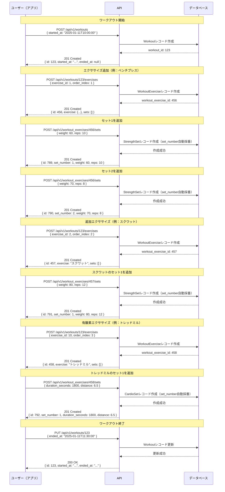

# ワークアウト記録フロー

## 概要

ユーザーがジムでのトレーニングを記録する際の基本的なフローを説明します。

## シーケンス図



## 詳細フロー

### 1. ワークアウト開始

```json
POST /api/v1/workouts
{
  "started_at": "2025-01-11T10:00:00Z"
}
```

レスポンス:
```json
{
  "id": 123,
  "started_at": "2025-01-11T10:00:00Z",
  "ended_at": null,
  "note": null
}
```

### 2. エクササイズを追加

```json
POST /api/v1/workouts/123/exercises
{
  "exercise_id": 1,
  "order_index": 1
}
```

レスポンス:
```json
{
  "id": 456,
  "exercise": {
    "id": 1,
    "name": "ベンチプレス",
    "body_part": "chest",
    "laterality": "bilateral"
  },
  "order_index": 1,
  "sets": []
}
```

### 3. セットを追加

筋トレセットの場合:
```json
POST /api/v1/workout_exercises/456/sets
{
  "weight": 60,
  "reps": 10,
  "bilateral": false
}
```

レスポンス:
```json
{
  "id": 789,
  "set_number": 1,
  "weight": 60,
  "reps": 10,
  "bilateral": false
}
```

有酸素セットの場合:
```json
POST /api/v1/workout_exercises/456/sets
{
  "duration_seconds": 1200,
  "distance": 5.0,
  "calories": 250
}
```

レスポンス:
```json
{
  "id": 790,
  "set_number": 1,
  "duration_seconds": 1200,
  "distance": 5.0,
  "calories": 250
}
```

### 4. ワークアウト終了

```json
PUT /api/v1/workouts/123
{
  "ended_at": "2025-01-11T11:30:00Z",
  "note": "今日は調子が良かった"
}
```

## 注意事項

- ワークアウトは開始時刻のみで作成可能（終了時刻は後から更新）
- エクササイズ追加とセット追加は別々のAPIコール
- セットは1つずつ追加（ユーザーがボタンを押すたびに追加）
- set_numberはAPI側で自動採番（該当エクササイズ内で連番）
- 筋トレと有酸素運動でセットの構造が異なる（body_partがcardioかどうかで判定）
- order_indexでワークアウト内のエクササイズの順序を管理